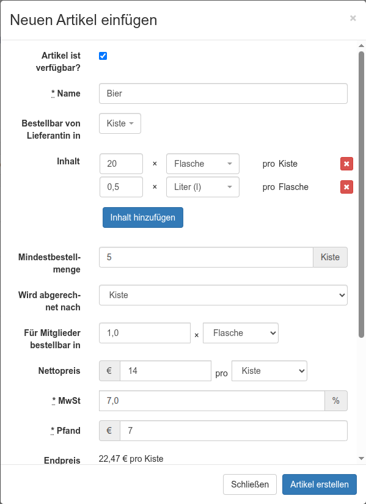

# Benutzerrelevante Änderungen in Foodsoft v5.0

Foodsoft 5.0 bringt drei grundsätzliche Anpassungen:

1. Standardisierte Artikeleinheiten

2. Verbesserte Artikelversionierung

3. Neue Artikelsynchronisation zwischen beliebigen Lieferantinnen

4. Technische Aktualisierung

Die folgende Kurzdokumentation geht hauptsächlich auf Punkt 1 ein, da dieser für die Artikeladministration die größten Umstellungen mit sich bringt.

## 1. Standardisierte Artikeleinheiten

Artikeldaten können (optional) auf standardisierte Einheiten umgestellt werden, was die Umrechnung erleichtern soll. Außerdem sollen damit die Interoperabilität mit anderen Systemen sowie die Mehrsprachigkeit verbessert werden.

Im Folgenden werden die Felder des Dialogs zum Bearbeiten von Artikeln (Artikel → Lieferanten/Artikel → Artikel → Bearbeiten) beschrieben:

### Obsolete Felder

* Freitext *Einheit* (Einheiten sollten künftig – damit die automatische Umrechnung möglich ist – aus den bereitgestellten Auswahllisten gewählt werden. Falls tatsächlich eine benutzerdefinierte Einheit nötig ist, kann unter *Bestellbar von Lieferantin in* die Option *Benutzerdefiniert* gewählt werden. Dann erscheint wieder die bisherige Texteingabe.)

* Freitext *Gebindegröße* (Diese wird künftig unter *Inhalt* abgebildet – siehe „Neue Felder“.)

### Neue Felder

#### Bestellbar von Lieferantin in

In dieser Einheit werden Artikel bei der Lieferantin bestellt.

##### Gebinde

Gebinde werden grundsätzlich auf Basis dieser Einheit berechnet – Beispiel:

* Für *Bestellbar von Lieferantin in* ist „Stück“ ausgewählt.

* Der *Inhalt* wurde als „1 Kilogramm“ definiert.

* Bei *Für Mitglieder bestellbar in* ist „100 × Gramm“ ausgewählt.

→ Dann können Bestellgruppen in 100-Gramm-Tranchen bestellen, der Artikel wird bei der Lieferantin aber nur in vollen Gebindegrößen von 1000 g bestellt. (Beispiele: 1100 g → 1000 g werden bestellt, 2400 g → 2000 g werden bestellt, 2400 g + 600 g Toleranz → 3000 g werden bestellt.)

*Achtung:* Gebinde werden nur dann angewendet, wenn bei *Bestellbar von Lieferantin in* eine Stückeinheit gewählt wurde (z. B. Stück, Packung, Glas usw.) und nicht eine SI-basierte Einheit (z. B. Gramm, Kilogramm, Liter usw.) – Beispiel:

* Für *Bestellbar von Lieferantin in* ist „Kilogramm“ ausgewählt.

* Bei *Für Mitglieder bestellbar in* ist „100 × Gramm“ ausgewählt.

Dann können Bestellgruppen in 100-Gramm-Tranchen bestellen, und es werden dabei keine Gebindegrößen für die Bestellung beim Lieferanten berechnet. (Beispiele: 1100 g → 1100 g werden bestellt, 2400 g → 2400 g werden bestellt.)

##### Verwendung der Einheit

Die Einheit wird an folgenden Stellen in der Foodsoft verwendet:

* Bestellung → Herunterladen → Fax PDF/Text/CSV

#### Inhalt

Hier können optional mehrere Zeilen hinzugefügt werden, die den Inhalt der unter *Bestellbar von Lieferantin in* gewählten Einheit definieren.

Der Inhalt der auf die erste Zeile folgenden Zeilen bezieht sich jeweils auf die vorhergehende Zeile.

Beispiel Bierkiste: *Bestellbar von Lieferantin in* ist „Kiste“, erste Zeile „20 × Flasche pro Kiste“, zweite Zeile „0,5 Liter pro Flasche“.

#### Mindestbestellmenge

Optionale Menge (bezogen auf *Bestellbar von Lieferantin in*), die insgesamt von allen Bestellgruppen einer Bestellung erreicht werden muss, damit dieser Artikel tatsächlich beim Lieferanten bestellt wird. (Ähnlich wie bei der Gebindegröße kann auch hier von den einzelnen Bestellgruppen eine Toleranz angegeben werden, für den Fall, dass die Bestellung noch unter der Mindestbestellmenge liegt.)

*Beispiel: Die Lieferantin verlangt, dass mindestens 5 Kisten Bier bestellt werden. 6 oder 7 Kisten sind aber auch möglich.*

#### Wird abgerechnet nach

Artikeleinheit, in die an folgenden Stellen in der Foodsoft umgerechnet wird:

* Bestellung → Sortiert nach Gruppen/Artikeln

* Bestellung → In Empfang nehmen

* Bestellung → Selbstbedienung

* Finanzen → Bestellung abrechnen

Hinweis: Das Feld ist nur verfügbar, wenn *Bestellbar von Lieferantin in* in andere Einheiten umgerechnet werden kann (d. h. wenn es entweder auf einer SI-Einheit wie Kilogramm basiert oder über *Inhalt* definiert wurde, worauf umgerechnet werden kann).

*Beispiel: Tofu wird packungsweise bestellt, aber die Lieferantin verrechnet die abgefüllte Menge genau nach Gramm. Je Mitglied wird die erhaltene Menge in Gramm notiert. Diese Mengen können nun im Abrechnungsmenü leichter angepasst werden.*

#### Für Mitglieder bestellbar in

Gibt die Granularität pro gewählter Einheit an, mit der Bestellgruppen bestellen können.

Beispiel: 100 × Gramm bedeutet, dass Bestellgruppen z. B. „200 Gramm“ bestellen können, nicht aber „240 Gramm“.

Hinweis: Das Auswahlfeld für die Einheit (z. B. Gramm) ist hierbei nur verfügbar, wenn *Bestellbar von Lieferantin in* in andere Einheiten umgerechnet werden kann. Die Menge, in der pro Bestellgruppe bestellt werden darf (Granularität), kann jedoch immer modifiziert werden.

Die Einheit wird an folgenden Stellen in der Foodsoft verwendet:

* Gruppenbestellung erstellen/editieren/betrachten

* Bestellung → Herunterladen → Gruppen/Artikel/Matrix PDF

* Bestellung → Artikelübersicht

*Beispiel: Die Mitglieder sollen einzelne Flaschen Bier bestellen können, obwohl insgesamt ganze Kisten bestellt werden.*

#### Nettopreis

Erlaubt nun zusätzlich die Auswahl einer Einheit, für die der Preis gilt. (Die Auswahl der Einheit dient nur der Artikeladministration – für den Fall, dass in den Preislisten Preise in einer anderen Einheit angegeben werden als *Bestellbar von Lieferantin in*.)

Beispiel: „0,50 € pro Dekagramm“

Hinweis: Das Auswahlfeld für die Einheit (z. B. Kiste) ist hierbei nur verfügbar, wenn *Bestellbar von Lieferantin in* in andere Einheiten umgerechnet werden kann.

### Verfügbare Artikeleinheiten

Intern verwendet Foodsoft 5.0 UNECE-Einheiten, von denen es sehr viele verschiedene gibt. Um die Anzahl der im Artikelformular wählbaren Einheiten gering zu halten, wurde eine Vorauswahl getroffen. Diese Auswahl kann bei Bedarf unter Artikel → Artikeleinheiten verändert werden. (Benötigt die Rolle „Artikeldatenbank“.)

Einheiten derselben Dimension (z.B. Gewicht, Volumen) können automatisch ineinander umgerechnet werden, z.B. Gramm in Kilogramm.

### Umstellung der Artikeldaten von Version 4.8

#### Automatische Umstellung

Die Umstellung der Artikeldaten von Foodsoft Version 4.8 auf 5.0 erfolgt teilweise automatisch:

*Bestellbar von Lieferantin in* wird initial für alle Artikel auf *Benutzerdefiniert* gesetzt, und das alte Freitextfeld *Einheit* wird weiterhin mit demselben Inhalt angezeigt.

War auch das nun obsolete Freitextfeld *Gebindegröße* befüllt, wird *Inhalt* mit „1 Stück“ vorbefüllt und *Für Mitglieder bestellbar in* ebenfalls auf „1 Stück“ gesetzt.

#### Migrations-Assistent

In der Artikelliste eines Lieferanten steht einmalig die Funktion „Alte Artikeleinheiten migrieren ...“ zur Verfügung. Darüber kann man im ersten Schritt ein Backup der Artikel als CSV herunterladen.

Im zweiten Schritt versucht das System, die alten Freitexteinheiten auf die neuen exakten Einheiten abzubilden. Die automatische Erkennung kann noch bearbeitet werden, ehe man die Migration durchführt.

### Gruppenbestellungen

Das Formular zum Erstellen von Gruppenbestellungen erlaubt nun (zusätzlich zu den +/- Buttons) die manuelle Eingabe der Menge. Das ist nötig, da nun – je nach Vorgabe im Artikelformular – freiere Werte möglich sind, die schwerer mit +/- zu erreichen wären. So könnte man beispielsweise 1001 kg von etwas bestellen oder auch 0,5 kg. Die +/- Buttons erhöhen bzw. verringern den Wert um die im Artikelformular eingestellte Granularität.

Außerdem gibt es ein Einheiten-Umrechnungs-Feature, sodass Mitglieder z.B. eingeben können, dass sie 1 kg möchten und sich berechnen lassen können, wie viele Packungen à 175 g sie dafür bestellen müssten.

### Selbstbedienung

Die Selbstbedienungsfunktion existierte bereits in Foodsoft 4.8. Allerdings empfanden die meisten sie als nicht gut verwendbar – eben *wegen* der fehlenden Möglichkeit der automatischen Umrechnung von Einheiten. Deshalb hier noch einmal eine kurze Erklärung zu ihrem Zweck und ihrer Funktionsweise:

#### Zweck der Funktion

Die Selbstbedienungsfunktion bietet einzelnen Bestellgruppen die Möglichkeit, selbst anzugeben, wenn sie mehr bzw. weniger als bestellt abgeholt haben. (Manche Foodcoops haben einen Workflow, bei dem ein „Ladendienst“ die empfangene Ware vorab auf alle Bestellgruppen aufteilt und ggf. – wenn zu viel oder zu wenig geliefert wurde – die Mengen in der Foodsoft korrigiert. Andere überlassen dieses Aufteilen lieber den einzelnen Bestellgruppen, um den Arbeitsaufwand des Ladendienstes zu verringern. Für diesen alternativen Workflow wurde diese Funktion bereitgestellt.)

#### Aktivierung der Funktion

Die Funktion ist standardmäßig deaktiviert. Um sie zu aktivieren, wähle unter Administration → Einstellungen die Option *Selbstbedienung verwenden* aus. (Benötigt die Rolle „Administration“.)

#### Workflow & Verwendung

1. Um die Funktion zu verwenden, muss – wie bisher – die geschlossene Bestellung über „In Empfang nehmen“ in der Foodsoft registriert werden. (Hilfreich ist es dabei, wenn im Profil der Benutzerinnen und Benutzer der betroffenen Bestellgruppen die Checkbox „Informiere mich über Lieferdetails (nachdem die Ware entgegengenommen wurde).“ aktiviert ist. Dann erhalten diese eine E-Mail mit Informationen darüber, ob zu viel oder zu wenig geliefert wurde.)

2. Anschließend kann jede Bestellgruppe unter Bestellungen → Selbstbedienung eine Liste der geschlossenen, noch nicht abgerechneten Bestellungen einsehen und in der Spalte „Verfügbarkeit“ erkennen, ob es von einem Artikel aktuell zu viel oder zu wenig gibt.

3. Der tatsächlich abgeholte Wert kann dann in der Spalte „Abgeholt“ korrigiert werden. Diese Korrektur wirkt sich direkt auf die Abrechnung aus. (Wenn keine Korrektur vorgenommen wurde oder die Selbstbedienungsseite gar nicht erst geöffnet wurde, geht das System davon aus, dass genau die richtige Menge abgeholt wurde.)

4. Unter „Transaktionen“ können Bestellgruppen außerdem direkt Transaktionen auf ihrem Konto erstellen. (Das ist z. B. praktisch für die Bezahlung von nicht im System registrierten Lagerartikeln.)

# 2. Artikelversionen

Intern wurde die Artikelversionierung aktualisiert. Bisher wurden nur die Artikelpreise versioniert – nun wird der gesamte Artikel versioniert.
Für Benutzerinnen sollte dies nur dadurch erkennbar sein, dass bei einer Änderung z.B. des Artikelnamens sich der Name *nicht* mehr bei vergangenen Bestellungen ändert.

Grundsätzlich funktioniert die Artikelversionierung so:

Ist eine Bestellung offen und man bearbeitet einen darin enthaltenen Artikel (egal welches Feld: Name, Preis usw.), dann ändern sich die Daten für die Bestellung ebenfalls.

Ist eine Bestellung jedoch geschlossen, bleiben alle enthaltenen Verweise auf diesen Artikel grundsätzlich unverändert („eingefroren“) und entsprechen dem Stand zum Zeitpunkt des Schließens der Bestellung. Das Bearbeiten des Artikels in der Artikelliste dieser Lieferantin wirkt sich nicht mehr darauf aus.

Ebenso können Artikeldaten für eine geschlossene Bestellung im Abrechnungsmenü angepasst werden, ohne dass sich dies auf andere Bestellungen auswirkt.

# 3. Lieferantensynchronisation

Foodsoft 5.0 erhält eine neue Funktion, mit der die Artikelliste eines beliebigen Lieferanten mit einem anderen Lieferanten geteilt werden kann (egal, ob in derselben Foodcoop oder einer anderen). Diese Funktion löst das Projekt `sharedlists` ab – die Funktion wird Teil von Foodsoft selbst.

1. Um die Funktion zu verwenden, kann man unter Artikel → Lieferanten/Artikel einen Lieferanten anklicken und anschließend links unten auf „Teilen“ klicken. (Wichtig: Damit die Synchronisation gut funktionieren kann, sollten die Artikel dieses Lieferanten Bestellnummern hinterlegt haben.)

2. Die dort angezeigte URL kann bei einem beliebigen anderen Lieferanten und in einer beliebigen anderen Foodsoft-5.0-Instanz (oder auch der aktuellen) unter Artikel → Lieferanten/Artikel → Bearbeiten eingetragen werden.

3. Bei dieser Lieferantin kann man anschließend in der Artikelliste auf „Synchronisieren“ klicken. Daraufhin öffnet sich eine Ansicht, in der die geänderten Werte gelb hinterlegt sind und die es erlaubt, vor dem Start der Synchronisation Daten zu bearbeiten.

# 4. Technische Aktualisierung

Die Foodsoft wurde dank eines deutschen Entwicklerteams auf neuere Versionen von Ruby/Rails/Bootstrap aktualisiert. Daher sehen nun einige Buttons und Menüs etwas anders aus. Fehler bitte gerne melden.
